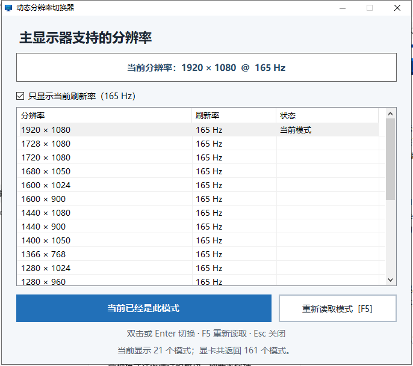

  

<h1 align="center">DynamicResolutionSwitcher</h1>

一个简单、免安装的 Windows 主显示器分辨率与刷新率切换工具。

工具会读取显卡驱动实际提供的显示模式，不把分辨率写死在代码里。默认只显示与当前刷新率相同的分辨率，取消筛选后可查看全部可用组合。

## 功能

- 动态读取主显示器支持的分辨率和刷新率
- 当前模式自动高亮
- 双击、按 Enter 或点击按钮即可切换
- 按 F5 重新读取显示模式
- 切换前先使用 Windows API 测试目标模式
- 无需安装，无需管理员权限

## 下载和使用

1. 打开仓库右侧的 **Releases**。
2. 下载 **DynamicResolutionSwitcher-v*-win.zip**。
3. 解压后运行 **DynamicResolutionSwitcher.exe**。
4. 选择模式并切换；屏幕短暂闪黑属于正常现象。

## 使用注意事项

- 仅支持 Windows 10/11。
- 当前版本只切换 **Windows 主显示器**，不提供多显示器选择。
- 列表内容完全取决于显卡驱动；不会创建新的自定义分辨率。
- NVIDIA、AMD 或 Intel 自定义分辨率需要先在对应显卡控制面板中创建。
- 建议保持“只显示当前刷新率”开启，确认显示器支持后再尝试其他刷新率。
- 当前版本没有倒计时自动恢复功能。即使 Windows API 测试通过，个别显示器在异常刷新率下仍可能黑屏。
- 若切换后显示异常，可尝试 **Win + Ctrl + Shift + B** 重启显卡驱动，或进入 Windows 显示设置恢复。
- 程序没有数字签名，从 GitHub 下载时 Windows SmartScreen 可能显示未知发布者；可以核对 Release 中的 SHA256。
- 本程序不联网、不收集数据，只调用 Windows user32.dll 的显示设置 API。

## 从源码构建

在 Windows PowerShell 中运行：

~~~powershell
powershell -ExecutionPolicy Bypass -File .\build.ps1
~~~

构建产物会生成在 **release** 文件夹：

- DynamicResolutionSwitcher.exe
- DynamicResolutionSwitcher-v1.0.0-win.zip
- SHA256SUMS.txt

Windows 10/11 已包含兼容的 .NET Framework，不需要额外安装第三方依赖。

## License

[MIT](LICENSE)
